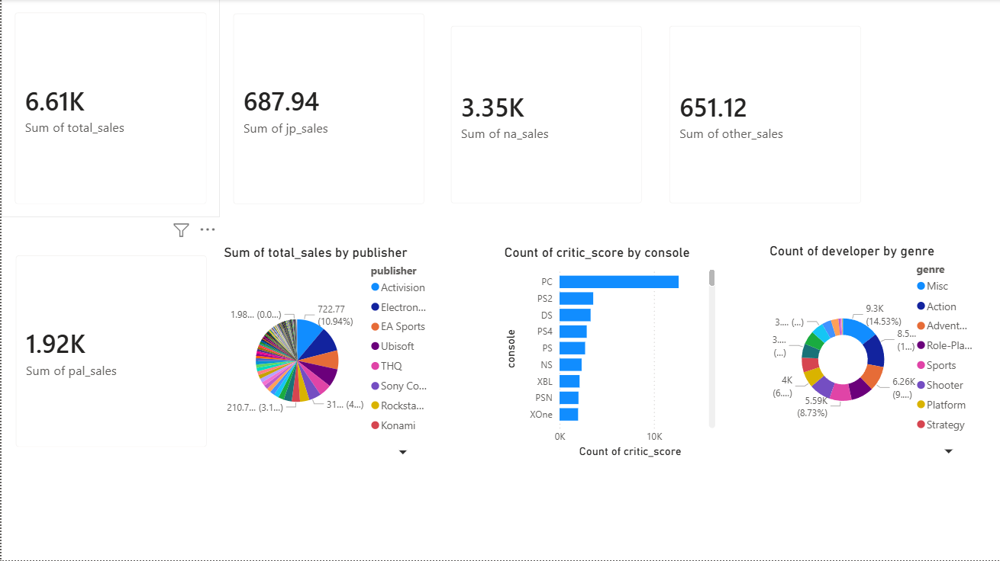
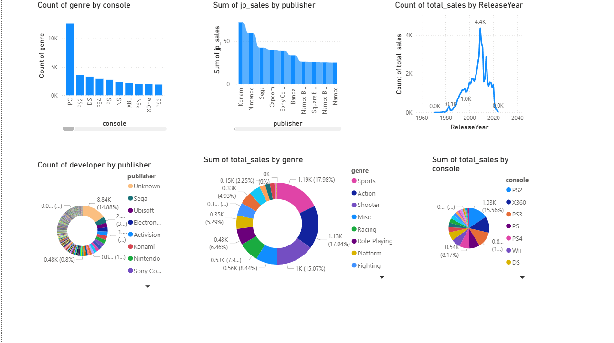
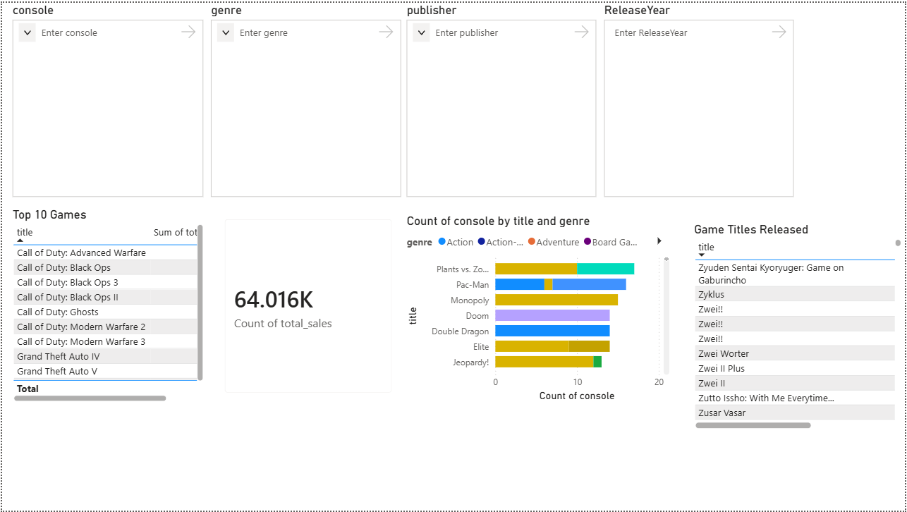

# GameScope Video Game Sales Analytics Dashboard

## Overview
Power BI dashboard developed during an APSSDC Data Analytics internship to analyze video game sales trends.

## Dataset
Analyzed 64,000+ video game sales records from 1971–2024.

## Tools Used
- Power BI
- Power Query
- Data Visualization

## Dashboard Features
- Sales analysis by publishers
- Console/platform performance analysis
- Genre-wise sales analysis
- Regional sales comparison
- Release year trends

## Key Insights
- Identified top-performing games and publishers.
- Analyzed sales trends across different years and regions.
- Studied platform and genre preferences.

## Repository Contents
- Power BI Dashboard (.pbix)
- Dataset
- Dashboard Screenshots
- Project Documentation

## Dashboard Preview

### Overview Dashboard

### Analysis Dashboard

### Insights Dashboard

